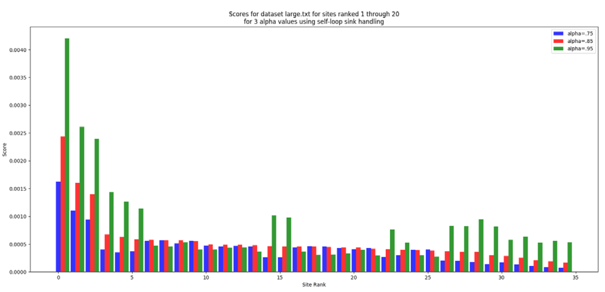
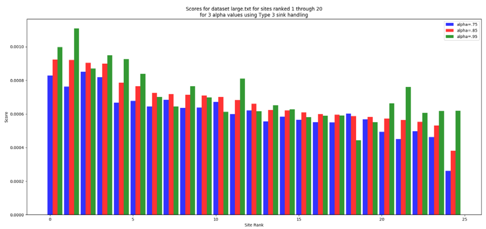

# PageRank

**GA8803 – Graduate Algorithms 
Georgia Institute of Technologies 
Spring 2018**

## Description
For this project, I implemented the PageRank algorithm, supporting two different strategies for handling sink nodes (giving every node a self-loop, and a method we will call “Type 3”, based on the explanation in video #26. Sink Handling in the instructional videos). The code runs on the sample data sets, verified against the correct solutions which have also been included. The code executes on the “Large.txt” file within 6 minutes, using an alpha value of .85 and Type 3 sink handling.

Graph of results for 3 alphas for self-loop sink handling 

Graph of results for 3 alphas for Type 3 sink handling 

## Report
Plots represent PageRank scores for the top 20 websites. From the plots, you can see that scores decrease with website ranks. Higher alpha values resulted in higher scores on average. Self-loop algorithm resulted in more extreme score distribution, where top 3 websites had especially high scores. 
Increasing alpha toward 1.0 increases website’s scores. However, it also increases running time. The higher the alpha, the less random is the agent’s behavior. Therefore, the scores distributed among websites highly depend on theirs interlinks, i.e. their hierarchical place in the web graph. 
The higher the alpha, the less randomness is involved. This means that the agent has less options for exploration, which results in longer conversion time. Alpha if like an exploration/exploitation rate (in reinforcement learning language). The higher the alpha, the smaller is the exploration rate, therefore, the slower is the conversion time. 
Self-loops had high scores for top 3 website and more uniformed scores for the rest. For alpha values of .75 and .95, score distribution was not monotonically decreasing, where websites with lower ranking sometimes had higher scores. For alpha of .85 the distribution was monotonically decreasing. 
Type 3 sink handling resulted in a more uniformed score distribution with no extreme values. As with self-loops, alpha values of .75 and .95 resulted in non-monotonically decreasing score distribution, whereas alpha of .85 resulted in monotonically decreasing score distribution. Looking at these graphs, I can now understand why alpha value of .85 was chosen by Google.

## Main File
pageRank.py
